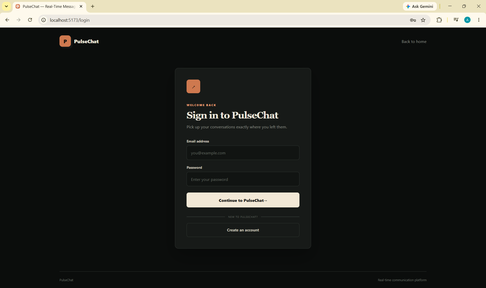
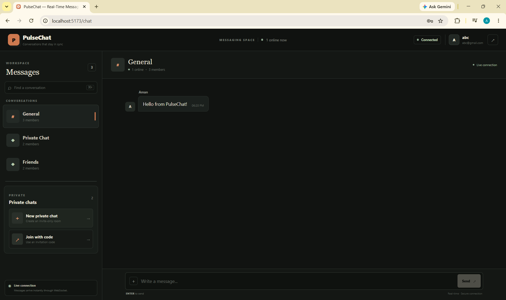
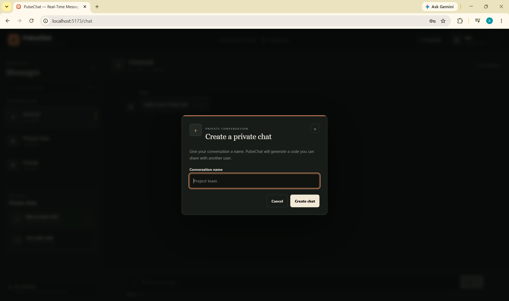
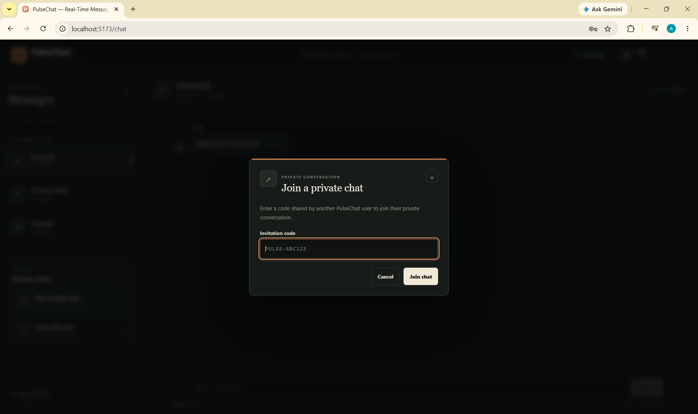

# 💬 PulseChat — Real-Time Messaging Platform

PulseChat is a full-stack real-time messaging platform developed as part of my **Full-Stack Web Development Internship at Prodigy InfoTech**.

The application allows users to create accounts, securely sign in, join chat rooms, create private conversations, and exchange messages in real time through WebSocket communication.

---

## 🚀 Live Features

* 🔐 User registration and secure login
* 🔑 JWT-based authentication
* 🍪 HTTP-only authentication cookies
* 👤 User account management
* 💬 Real-time text messaging
* 🌐 WebSocket-based communication
* 🏠 Public chat rooms
* 🔒 Private conversations
* ➕ Create private chats
* 🔗 Private chat invite codes
* 👥 Room membership management
* 🟢 Online user presence
* 📡 Real-time room presence updates
* 💾 MongoDB message persistence
* 📜 Chat history
* 🚪 Join and leave chat rooms
* 📱 Responsive chat interface

---

## 🖥️ Project Showcase

### 🔐 Sign In

Users can securely sign in to their PulseChat account using their registered email and password.



---

### 🏠 Dashboard

The PulseChat dashboard provides access to available conversations, chat rooms, private conversations, online status and real-time connection information.



---

### ➕ Create Private Chat

Users can create a private conversation and generate an invite code that can be shared with another user to join the conversation.



---

### 💬 Private Chat

Private conversations support real-time messaging using WebSocket communication. Messages are delivered instantly to connected participants and stored in MongoDB.



---

## 🛠️ Tech Stack

### Frontend

* React.js
* Vite
* JavaScript
* CSS
* React Router

### Backend

* Node.js
* Express.js
* WebSocket (`ws`)

### Database

* MongoDB
* Mongoose
* MongoDB Atlas

### Authentication & Security

* JWT
* bcryptjs
* HTTP-only Cookies
* CORS
* cookie-parser
* dotenv

### Development Tools

* VS Code
* Git
* GitHub
* npm
* MongoDB Atlas

---

## ⚡ Real-Time Communication

PulseChat uses **WebSocket communication** to provide real-time messaging.

The application uses:

* **REST APIs** for authentication, rooms and chat history
* **WebSocket** for real-time messaging
* **MongoDB** for persistent message storage

### Message Flow

```text
User
  ↓
React Frontend
  ↓
WebSocket Connection
  ↓
Node.js WebSocket Server
  ↓
MongoDB
  ↓
WebSocket Broadcast
  ↓
Other Connected Users
```

---

## 🔐 Authentication Flow

```text
Register
   ↓
Password Hashing using bcryptjs
   ↓
MongoDB User
   ↓
Login
   ↓
JWT Token
   ↓
HTTP-only Cookie
   ↓
Authenticated Requests
```

Passwords are hashed before being stored in the database, while JWT authentication is used to protect authenticated routes.

---

## 📂 Project Structure

```text
PRODIGY_WD_04/

├── client/
│   ├── public/
│   │   └── pulsechat.svg
│   │
│   └── src/
│       ├── pages/
│       │   ├── Landing.jsx
│       │   ├── Login.jsx
│       │   ├── Register.jsx
│       │   └── Chat.jsx
│       │
│       ├── App.jsx
│       ├── App.css
│       ├── index.css
│       └── main.jsx
│
├── server/
│   ├── config/
│   │   └── db.js
│   │
│   ├── controllers/
│   │   ├── authController.js
│   │   ├── messageController.js
│   │   └── roomController.js
│   │
│   ├── middleware/
│   │   └── authMiddleware.js
│   │
│   ├── models/
│   │   ├── Message.js
│   │   ├── Room.js
│   │   └── User.js
│   │
│   ├── routes/
│   │   ├── authRoutes.js
│   │   ├── messageRoutes.js
│   │   └── roomRoutes.js
│   │
│   ├── websocket/
│   │   └── websocketServer.js
│   │
│   ├── server.js
│   ├── package.json
│   └── .env.example
│
├── screenshots/
│   ├── 01-signin.png
│   ├── 02-dashboard.png
│   ├── 03-create-private-chat.png
│   └── 04-private-chat.png
│
├── .gitignore
└── README.md
```

---

## 🔌 API Overview

### Authentication

```text
POST /api/auth/register
POST /api/auth/login
GET  /api/auth/me
POST /api/auth/logout
```

### Chat Rooms

```text
POST  /api/rooms
GET   /api/rooms
POST  /api/rooms/:roomId/join
```

### Private Conversations

```text
POST  /api/rooms/private/create
POST  /api/rooms/private/join
PATCH /api/rooms/private/:roomId/name
```

### Messages

```text
POST /api/messages
GET  /api/messages/room/:roomId
```

### Health Check

```text
GET /api/health
```

---

## 🔌 WebSocket Events

PulseChat uses WebSocket events for real-time communication.

### Client Events

```text
join_room
leave_room
room_message
```

### Server Events

```text
authenticated
room_joined
new_message
presence_update
room_presence_update
```

---

## ▶️ Running the Project Locally

### 1. Clone the Repository

```bash
git clone https://github.com/still-aman2626/PRODIGY_WD_04.git
```

### 2. Navigate to the Project

```bash
cd PRODIGY_WD_04
```

### 3. Install Client Dependencies

```bash
cd client
npm install
```

### 4. Install Server Dependencies

Open another terminal:

```bash
cd server
npm install
```

### 5. Configure Environment Variables

Create:

```text
server/.env
```

Add:

```env
PORT=5000
MONGO_URI=your_mongodb_connection_string
JWT_SECRET=your_jwt_secret
CLIENT_URL=http://localhost:5173
```

### 6. Start the Backend

From the `server` directory:

```bash
npm run dev
```

The backend will run on:

```text
http://localhost:5000
```

### 7. Start the Frontend

From the `client` directory:

```bash
npm run dev
```

The frontend will run on:

```text
http://localhost:5173
```

---

## 🎯 Learning Outcomes

Through this project, I gained practical experience in:

* Building full-stack React applications
* Creating REST APIs with Express.js
* Implementing JWT authentication
* Securing passwords using bcryptjs
* Working with HTTP-only cookies
* Designing MongoDB schemas using Mongoose
* Building real-time applications using WebSockets
* Managing WebSocket connections and room membership
* Implementing real-time presence updates
* Connecting frontend and backend systems
* Managing application state in React
* Using Git and GitHub for version control

---

## 👨‍💻 Internship Project

This project was developed as **Task 4** of the:

**Full-Stack Web Development Internship**
**Prodigy InfoTech**

---

## 🔗 GitHub Repository

[PulseChat — PRODIGY_WD_04](https://github.com/still-aman2626/PRODIGY_WD_04)
